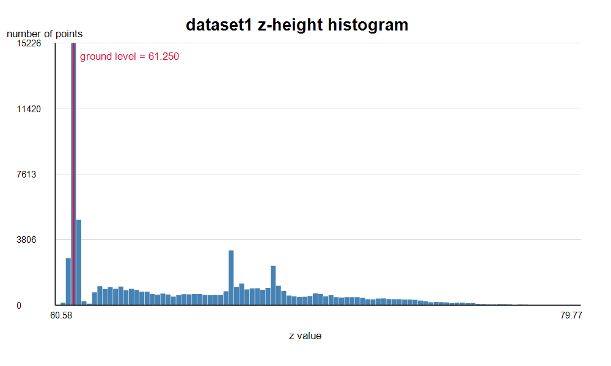
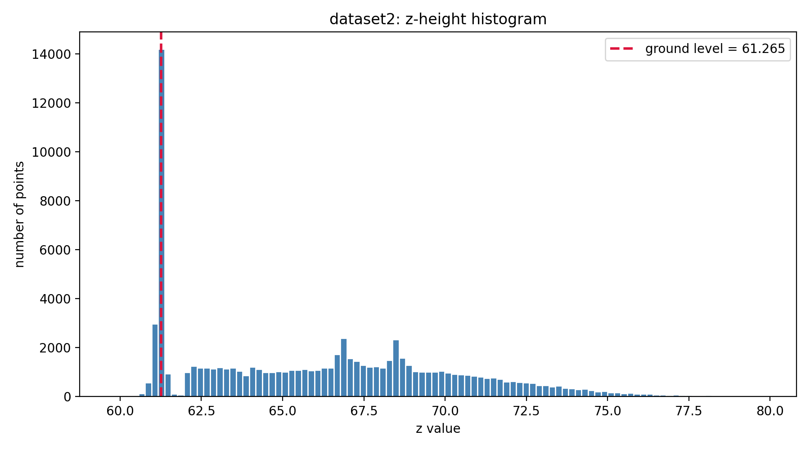
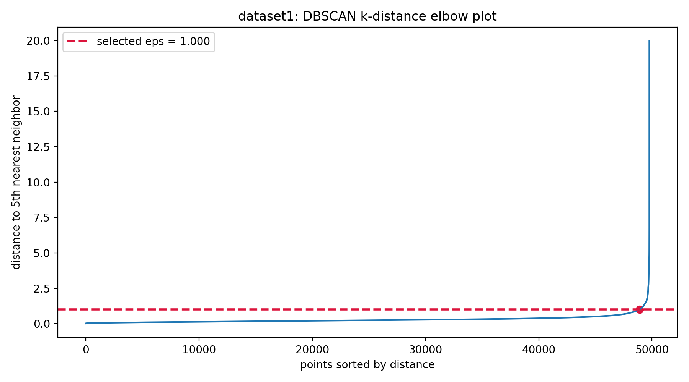
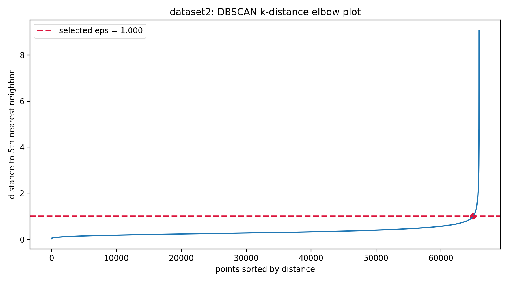
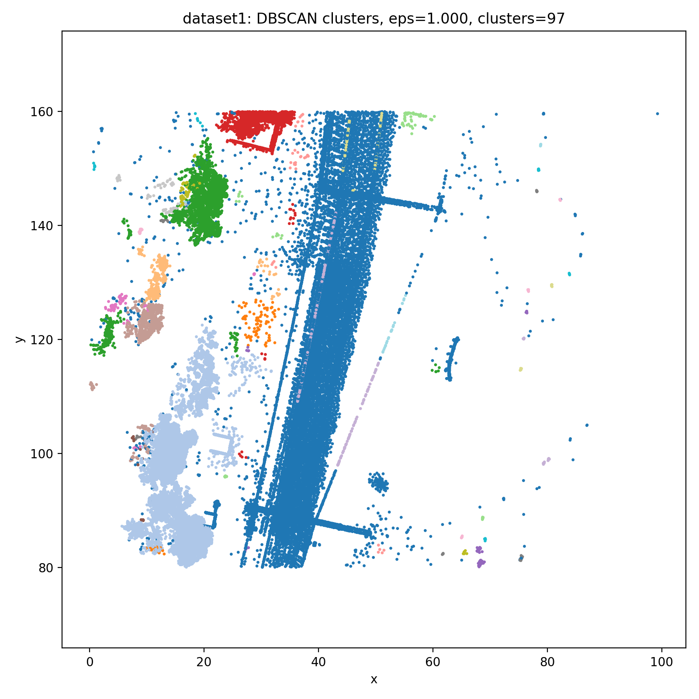
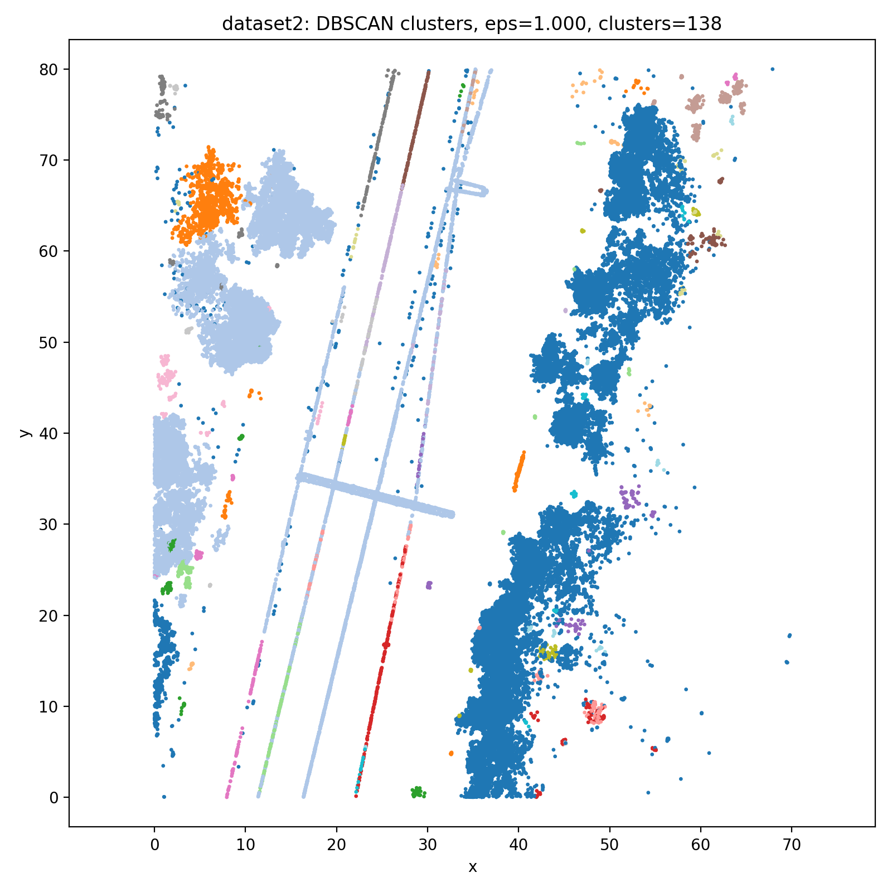

# D7015B Assignment 5

## Task 1: Ground Level

I used a histogram of the z-values to find the ground area. The ground gives the biggest peak in the histogram because many LiDAR points are reflected from the ground.

Instead of using the exact peak as the cutoff, I use the next histogram bin. This removes a bit more of the ground before clustering.

Ground thresholds:

| Dataset | Ground threshold |
| --- | ---: |
| Dataset 1 | 61.442 |
| Dataset 2 | 61.466 |

After removing the ground, the remaining point clouds contain:

| Dataset | Points above ground |
| --- | ---: |
| Dataset 1 | 49,762 |
| Dataset 2 | 65,894 |

### Ground Histograms

Dataset 1:

Dataset 2:

## Task 2: DBSCAN Clustering

For clustering I used DBSCAN. It groups points that are close together in dense areas, and points that do not fit into a dense area are marked as noise. This works well for the point cloud because we do not need to know the number of clusters beforehand.

I used a k-distance elbow plot to choose `eps`. If `eps` is too small, one object can split into many small clusters. If it is too large, different objects can merge. From the elbow plots I used `eps = 1.000` for both datasets with `min_samples = 5`.

DBSCAN results:

| Dataset | eps | Number of clusters | Noise points |
| --- | ---: | ---: | ---: |
| Dataset 1 | 1.000 | 113 | 542 |
| Dataset 2 | 1.000 | 138 | 565 |

The main corridor/catenary structures are visible in the cluster plots. There are still some small noisy clusters, especially in dataset 2, but the result is clear enough to continue with cluster selection.

### Elbow Plots

Dataset 1:

Dataset 2:

### Cluster Plots

Dataset 1:

Dataset 2:

The DBSCAN cluster plots look decent overall. We can see what looks like rail joints or track-side structures in light blue, and the longer cable/catenary parts are also separated quite clearly from the rest of the points. Some smaller clusters are still visible around the sides, so the result is not perfectly clean, but most of the important structures are easier to identify after removing the ground and running DBSCAN.

## Task 3: Catenary Cluster

For this assignment, I decided to not complete task 3 because of work load in other courses.
